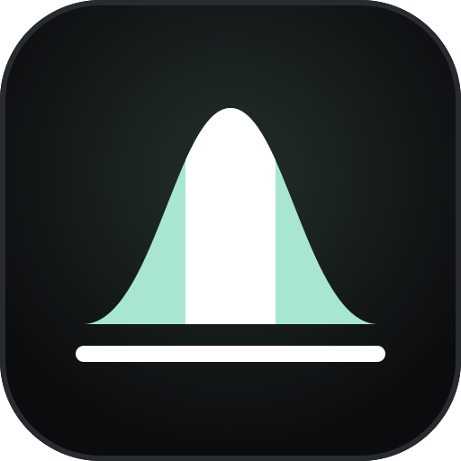
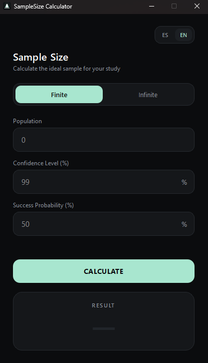

<div align="center">



# 📊 Sample Size Calculator

**A modern, minimal desktop app to calculate the ideal sample size for your research, surveys and studies.**

[](https://www.python.org/)
[](https://pypi.org/project/PyQt6/)
[](LICENSE)
[](#-requirements)

</div>

---

## 📑 Table of Contents

- [✨ Overview](#-overview)
- [🎯 Features](#-features)
- [🖼️ Screenshots](#️-screenshots)
- [🧮 How It Works](#-how-it-works)
- [🛠️ Tech Stack](#️-tech-stack)
- [📋 Requirements](#-requirements)
- [🚀 Installation](#-installation)
- [▶️ Usage](#️-usage)
- [📦 Build a Standalone Executable](#-build-a-standalone-executable)
- [🗂️ Project Structure](#️-project-structure)
- [🤝 Contributing](#-contributing)
- [📄 License](#-license)

---

## ✨ Overview

**Sample Size Calculator** is a lightweight desktop application built with **Python** and **PyQt6** that helps students, researchers, statisticians and market analysts determine how many individuals they need to survey to obtain statistically reliable results.

Whether you are working with a **known population** (for example, the 2,500 students of a school) or an **unknown or very large population**, the app gives you the minimum sample size in a single click, using the classic statistical formulas based on the **normal distribution (Z-table)**.

The interface is designed to be **clean, dark and distraction-free**, with a mint-green accent palette and full **English / Spanish** support.

---

## 🎯 Features

| | Feature | Description |
|---|---|---|
| 🔢 | **Finite population** | Calculates the sample size when the total population size is known. |
| ♾️ | **Infinite population** | Calculates the sample size when the population is unknown or very large. |
| 🎚️ | **Configurable confidence level** | Set your desired confidence level as a percentage (default: `99%`). |
| 🎲 | **Configurable success probability** | Set the expected success probability `p` (default: `50%`, the most conservative case). |
| 🌍 | **Bilingual interface** | Switch instantly between **English** and **Spanish** with a single click. |
| 🎨 | **Modern dark UI** | Black, mint-green and white palette with segmented controls and smooth animations. |
| ✅ | **Input validation** | Only numeric input is accepted, with inline error messages for invalid values. |
| ⌨️ | **Keyboard friendly** | Press <kbd>Enter</kbd> in any field to calculate. |
| 🪶 | **Lightweight** | No heavy dependencies, only PyQt6. |

---

## 🖼️ Screenshots

<div align="center">
  
</div>

---

## 🧮 How It Works

The calculator relies on the standard sample size formulas for proportions.

### Finite population

```
        N · Z² · p · q
n = ─────────────────────────
     e² · (N − 1) + Z² · p · q
```

### Infinite population

```
      Z² · p · q
n = ───────────────
          e²
```

| Symbol | Meaning |
|:---:|---|
| `n` | Required sample size |
| `N` | Population size *(finite case only)* |
| `Z` | Z-score associated with the confidence level (looked up in a built-in Z-table) |
| `p` | Probability of success |
| `q` | Probability of failure, `q = 1 − p` |
| `e` | Margin of error, `e = 1 − confidence level` |

> ℹ️ **Note:** If you leave the confidence level or the success probability empty (or enter an invalid value), the app falls back to the defaults of **99%** and **50%** respectively.

---

## 🛠️ Tech Stack

| Technology | Purpose |
|---|---|
| 🐍 **Python 3.11+** | Core language |
| 🖥️ **PyQt6** | Graphical user interface (widgets, layouts, QSS styling, animations) |
| 📐 **`decimal` (stdlib)** | Precise percentage arithmetic |
| 📊 **Z-table lookup** | Built-in normal distribution table for Z-score resolution |

The project is split into two clear layers:

- 🧠 **Backend** – `SampleSize.py`: all statistical logic, independent from the UI.
- 🎨 **Frontend** – `Program.py`: the PyQt6 interface, styled with QSS.

---

## 📋 Requirements

- 🐍 **Python 3.11 or higher** – [Download Python](https://www.python.org/downloads/)
- 📦 **pip** (included with Python)
- 🖥️ Windows, macOS or Linux

---

## 🚀 Installation

### 1️⃣ Clone the repository

```bash
git clone https://github.com/ia-MarvinRios/Sample-Size-Calculator.git
cd Sample-Size-Calculator
```

### 2️⃣ (Recommended) Create a virtual environment

<details>
<summary><b>🪟 Windows</b></summary>

```bash
python -m venv venv
venv\Scripts\activate
```
</details>

<details>
<summary><b>🍎 macOS / 🐧 Linux</b></summary>

```bash
python3 -m venv venv
source venv/bin/activate
```
</details>

### 3️⃣ Install the dependencies

```bash
pip install PyQt6
```

### 4️⃣ Run the app

```bash
python Program.py
```

---

## ▶️ Usage

### 🔢 Finite population

1. Select the **Finite** tab.
2. Enter the **population** size.
3. Enter the **confidence level** (%).
4. Enter the **success probability** (%).
5. Click **Calculate** (or press <kbd>Enter</kbd>).

### ♾️ Infinite population

1. Select the **Infinite** tab.
2. Enter the **confidence level** (%).
3. Enter the **success probability** (%).
4. Click **Calculate** (or press <kbd>Enter</kbd>).

### 🌍 Change language

Use the **ES | EN** switch in the top-right corner of the window.

### 💡 Example

| Input | Value |
|---|---|
| Population | `1000` |
| Confidence level | `95` |
| Success probability | `50` |

The result is shown in the large mint-colored card at the bottom of the window.

---

## 📦 Build a Standalone Executable

Want to share the app without requiring Python? Package it with [PyInstaller](https://pyinstaller.org/):

```bash
pip install pyinstaller
pyinstaller --noconsole --onefile --icon=icon.ico --name "SampleSizeCalculator" Program.py
```

The executable will be generated inside the `dist/` folder.

> 🪟 On Windows, make sure `icon.ico` is in the project root. The app loads it at runtime, so when distributing, place it next to the executable or bundle it with `--add-data "icon.ico;."`.

---

## 🗂️ Project Structure

```
Sample-Size-Calculator/
├── 📄 Program.py            # PyQt6 user interface
├── 📄 SampleSize.py      # Statistical logic (Z-table + formulas)
├── 🎨 icon.svg           # Vector app icon
├── 🎨 icon.ico           # Windows app icon
├── 📁 docs/              # Screenshots
├── 📄 README.md
├── 📄 LICENSE
└── 📄 .gitignore
```

---

## 🤝 Contributing

Contributions, issues and feature requests are welcome!

1. 🍴 Fork the project
2. 🌿 Create your feature branch: `git checkout -b feature/amazing-feature`
3. 💾 Commit your changes: `git commit -m "Add amazing feature"`
4. 📤 Push to the branch: `git push origin feature/amazing-feature`
5. 🔃 Open a Pull Request

---

## 📄 License

This project is released under the **CC0 1.0 Universal** license. See the [LICENSE](LICENSE) file for details.

---

<div align="center">

Made with 💚 by [ia-MarvinRios](https://github.com/ia-MarvinRios)

⭐ If you find this project useful, consider giving it a star!

</div>